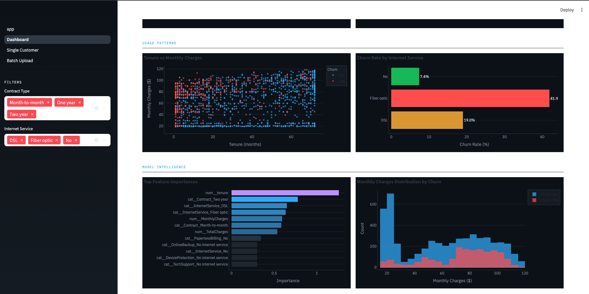

# Telecom_Customer_Churn_Prediction_ML_System

# 📊 Telco Churn Analytics
### Customer Churn Prediction & Retention Analytics Platform

> An end-to-end Machine Learning solution that predicts customer churn, identifies high-risk customers, and recommends retention strategies through an interactive Streamlit application.


---

# 🚀 Project Overview

Customer churn is one of the biggest challenges in the telecommunications industry. Acquiring a new customer can cost **5–7x more** than retaining an existing one.

This project develops a **production-ready churn prediction platform** capable of:

- Predicting customers likely to churn
- Identifying high-risk customers
- Providing business-friendly retention recommendations
- Supporting both single customer predictions and batch scoring

The project was developed as the **Master's Capstone Project** for the **Master of Science in Data Analytics** program at **Clark University**.

---

# 📸 Project Preview

## 🖥️ Streamlit Dashboard

<p align="center">

</p>

---

## 📈 Model Performance

<p align="center">

</p>

---

## 🧠 Churn Prediction Pipeline

<p align="center">

</p>

---

# 🎯 Business Problem

Telecommunication companies lose millions every year because customers silently switch providers.

Instead of reacting after a customer leaves, businesses need a system capable of predicting churn early enough to intervene.

Our solution enables proactive customer retention using Machine Learning.

---

# 📂 Dataset

**IBM Telco Customer Churn Dataset**

- 7,043 Customers
- 21 Features
- Binary Classification
- Public Benchmark Dataset

Features include:

- Customer Demographics
- Contract Information
- Services
- Billing Details
- Internet Usage
- Payment Method
- Tenure

---

# ⚙️ Tech Stack

### Programming

- Python

### Libraries

- Pandas
- NumPy
- Scikit-Learn
- XGBoost
- Imbalanced-Learn

### Visualization

- Matplotlib
- Seaborn

### Deployment

- Streamlit

### Version Control

- Git
- GitHub

---

# 🔍 Machine Learning Workflow

- Exploratory Data Analysis
- Data Cleaning
- Feature Engineering
- Missing Value Imputation
- One-Hot Encoding
- Standard Scaling
- Class Imbalance Handling
- Hyperparameter Tuning
- Threshold Optimization
- Streamlit Deployment

---

# 🤖 Models Evaluated

A total of **15 different model configurations** were evaluated.

Algorithms included:

- Logistic Regression
- Random Forest
- XGBoost
- Support Vector Classifier

Each model was tested using:

- Baseline
- Class Weights
- SMOTE
- SMOTETomek

---

# 🏆 Best Performing Model

**Logistic Regression + SMOTETomek**

| Metric | Score |
|---------|-------|
| Recall | **80.21%** |
| ROC-AUC | **0.8395** |
| F1 Score | **61.79%** |

### Key Business Achievement

✅ Reduced missed churners by **55%**

---

# 💡 Key Business Insights

The strongest indicators of churn were:

- Month-to-Month Contracts
- Fiber Internet Users
- Electronic Check Payments
- Short Customer Tenure

These insights help businesses prioritize retention campaigns.

---

# 🌐 Streamlit Application

The application supports:

✔ Single Customer Prediction

✔ Batch CSV Upload

✔ Risk Classification

✔ Churn Probability

✔ Retention Recommendations

---

# 📁 Repository Structure

```
Telco-Churn-Analytics/
│
├── app/
│   ├── streamlit_app.py
│
├── notebooks/
│   ├── EDA.ipynb
│   ├── Modeling.ipynb
│   ├── Threshold_Tuning.ipynb
│
├── src/
│   ├── preprocessing.py
│   ├── train.py
│
├── artifacts/
│   ├── pipeline.pkl
│
├── images/
│   ├── dashboard.png
│   ├── results.png
│   ├── pipeline.png
│
├── requirements.txt
│
└── README.md
```

---

# 📊 Future Improvements

- SHAP Explainability
- Real-Time API Deployment
- Docker Containerization
- CI/CD Pipeline
- MLflow Experiment Tracking
- Drift Detection
- AWS Deployment

---

⭐ If you found this project interesting, consider giving it a **Star** on GitHub!
